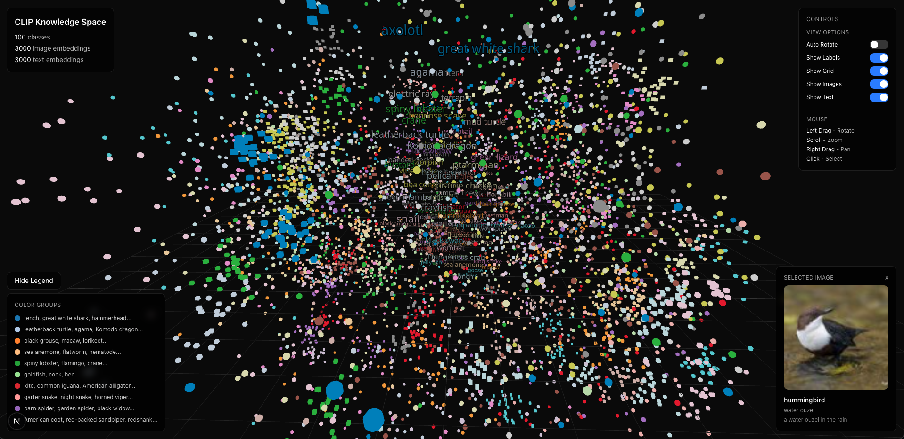
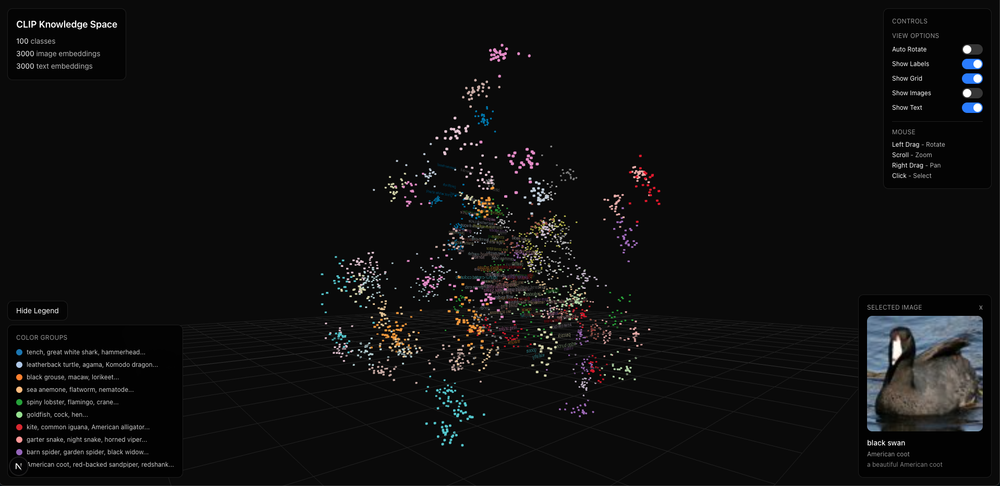

# CLIP MODEL

Last Semester (fall 2025) I tooked a deep learning lecture where in mid term there was a project to train CLIP MODEL on some dataset i forget the name of the dataset, i already knew Transformer at that time and was able to implement basic `attn_score = Q @ k.t` so i tried to write most of the core concepts from scratch, but i will be honest the code you see for dataset structuring that was **AI** i was more locked into the main core architecture implementation rather than preprocessing 

**My exam implementation will be in `joshi_exam.ipynb` file**

### Prereq concepts

- pytorch API
- How Attention Works (attn_score -> softmax -> attn_weights just conceptual understanding of it)
- Why do we add positional embeddings stuff!

Initially i trained this model for 5 epochs (computational constraints), before uploading here i might run it on some real dataset to show the actual working rather than just implementation slop

----

**NOTE**: I have revised everything i reimplemented from scratch using 8 A100 GPUS for practice noting on production level accuracy was bad too like 8% but it serves its purpose of learning

Most of the code in the `utils` dir is Vibe coded, my main goal was to understand the core concepts and implement them from scratch without hazzle of preprocessing

Before you use this model try to change the paths, and `next.js webapp` code will be inside clip_fiber
it uses packages like 
    - React Three Fiber
    - Three.js
    - shadcn etc which is also vibe coded

