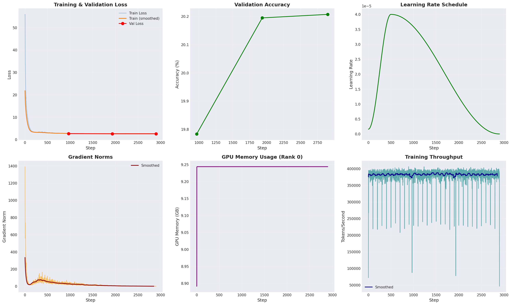

```sh
ESMForMaskedLM(
  (esm): ESMModel(
    (embeddings): ESMEmbeddings(
      (token_embedding): Embedding(33, 768, padding_idx=0)
      (position_embedding): Embedding(1026, 768, padding_idx=0)
      (layer_norm): LayerNorm((768,), eps=1e-05, elementwise_affine=True)
      (dropout): Dropout(p=0.1, inplace=False)
    )
    (transformer): Transformer(
      (layers): ModuleList(
        (0-11): 12 x TransformerLayer(
          (attention): MultiHeadAttention(
            (q_proj): Linear(in_features=768, out_features=768, bias=True)
            (k_proj): Linear(in_features=768, out_features=768, bias=True)
            (v_proj): Linear(in_features=768, out_features=768, bias=True)
            (fc_out): Linear(in_features=768, out_features=768, bias=True)
          )
          (attention_layer_norm): LayerNorm((768,), eps=1e-12, elementwise_affine=True)
          (fc1): Linear(in_features=768, out_features=3072, bias=True)
          (fc2): Linear(in_features=3072, out_features=768, bias=True)
          (ffn_layer_norm): LayerNorm((768,), eps=1e-12, elementwise_affine=True)
          (dropout): Dropout(p=0.1, inplace=False)
        )
      )
    )
  )
  (lm_head): Sequential(
    (0): Linear(in_features=768, out_features=768, bias=True)
    (1): GELU(approximate='none')
    (2): LayerNorm((768,), eps=1e-12, elementwise_affine=True)
    (3): Linear(in_features=768, out_features=33, bias=False)
  )
)
===========================================================================
Layer (type:depth-idx)                             Param #
===========================================================================
ESMForMaskedLM                                     --
├─ESMModel: 1-1                                    --
│    └─ESMEmbeddings: 2-1                          --
│    │    └─Embedding: 3-1                         25,344
│    │    └─Embedding: 3-2                         787,968
│    │    └─LayerNorm: 3-3                         1,536
│    │    └─Dropout: 3-4                           --
│    └─Transformer: 2-2                            --
│    │    └─ModuleList: 3-5                        85,054,464
├─Sequential: 1-2                                  --
│    └─Linear: 2-3                                 590,592
│    └─GELU: 2-4                                   --
│    └─LayerNorm: 2-5                              1,536
│    └─Linear: 2-6                                 25,344
===========================================================================
Total params: 86,486,784
Trainable params: 86,486,784
Non-trainable params: 0
===========================================================================
Padded input shape: torch.Size([4, 120])
Sequence lengths: [50, 80, 100, 120]
Output logits shape: torch.Size([4, 120, 33])
```
