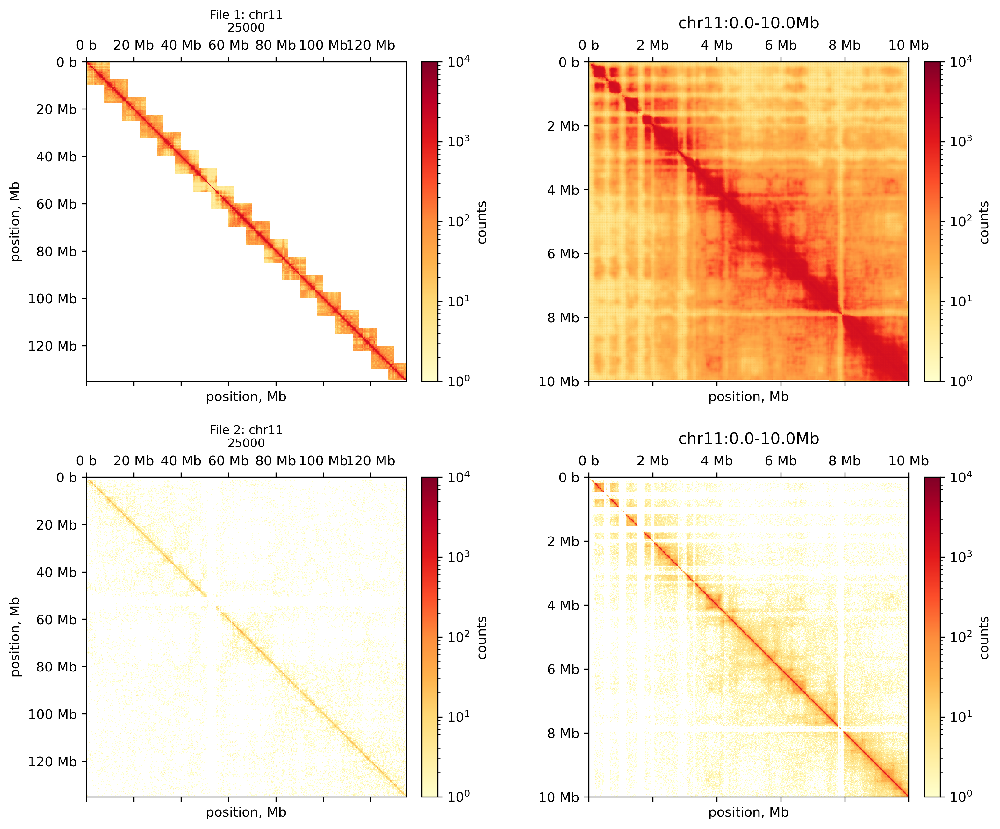

# Hi-C Coverage Enhancer

A deep learning pipeline for enhancing low-coverage Hi-C contact matrices to high-coverage quality using a hybrid UNet-Transformer architecture.



## Overview

This tool uses a trained neural network to enhance Hi-C contact matrices from low-coverage sequencing data, predicting what the data would look like with higher sequencing depth. The model combines:

- **UNet architecture** for multi-scale feature extraction
- **Transformer layers** for capturing long-range interactions
- **Learnable wavelet decomposition** for frequency-aware processing
- **2D positional encoding** for spatial awareness

## Features

- ✅ Memory-efficient tiled processing for large chromosomes
- ✅ Support for `.mcool` file format
- ✅ Configurable resolution and batch size
- ✅ GPU acceleration (with CPU fallback)
- ✅ Modular codebase for easy customization

## Installation

### Prerequisites

- Python 3.8+
- CUDA (optional, for GPU acceleration)

### Setup

```bash
# Clone the repository
git clone https://github.com/yourusername/hic-coverage-enhancer.git
cd hic-coverage-enhancer

# Create virtual environment (recommended)
python -m venv venv
source venv/bin/activate  # Linux/Mac
# or: venv\Scripts\activate  # Windows

# Install dependencies
pip install -r requirements.txt
```

## Quick Start

### 1. Preprocessing

Prepare your Hi-C data for training:

```bash
python preprocessing.py
```

**Configuration** (edit `preprocessing.py` at the bottom):

```python
pipeline.run(
    mcool_files=[
        "/path/to/your/sample1.mcool",
        "/path/to/your/sample2.mcool",
    ],
    resolutions=[25000],  # Resolution(s) to process
    output_dir='./training_data',
    use_all_chroms=False,
    max_memory_gb=4.0  # Adjust based on your system RAM
)
```

### 2. Training

Train the enhancement model:

```bash
python run_training.py
```

**Configuration** (edit `run_training.py`):

```python
# Data paths
TRAIN_DATA = './training_data/train_dataset.npz'
VAL_DATA = './training_data/val_dataset.npz'

# Training parameters
config = Config()
config.training.epochs = 50
config.training.batch_size = 16
config.training.learning_rate = 1e-4
```

Training outputs are saved to `./experiments/hic_enhancement_YYYYMMDD_HHMMSS/`:
- `best_model.pth` - Best model checkpoint
- `training_curves.png` - Loss and metric plots
- `predictions.png` - Sample predictions
- `config.json` - Training configuration

### 3. Inference

Enhance a Hi-C mcool file:

```bash
python inference.py \
    --model ./experiments/hic_enhancement_*/best_model.pth \
    --input /path/to/input.mcool \
    --output ./enhanced_output.mcool \
    --resolution 25000
```

**Options:**

| Argument | Default | Description |
|----------|---------|-------------|
| `--model` | required | Path to trained model checkpoint |
| `--input` | required | Input mcool file |
| `--output` | required | Output enhanced mcool file |
| `--resolution` | 25000 | Resolution to process |
| `--tile-size` | 500 | Tile size for memory-efficient processing |
| `--batch-size` | 8 | Batch size for inference |
| `--chromosomes` | all | Specific chromosomes to process |
| `--device` | auto | Device: 'auto', 'cuda', or 'cpu' |

**Examples:**

```bash
# Enhance all chromosomes
python inference.py --model best_model.pth --input data.mcool --output enhanced.mcool

# Enhance specific chromosomes only
python inference.py --model best_model.pth --input data.mcool --output enhanced.mcool \
    --chromosomes chr21 chr22

# Use smaller batch size for limited memory
python inference.py --model best_model.pth --input data.mcool --output enhanced.mcool \
    --batch-size 4 --tile-size 300
```

## Project Structure

```
hic-coverage-enhancer/
├── config.py           # Configuration dataclasses
├── dataset.py          # Dataset classes for training
├── inference.py        # Inference script for enhancement
├── metrics.py          # Evaluation metrics (SSIM, PSNR, etc.)
├── model.py            # Neural network architecture
├── preprocessing.py    # Data preprocessing pipeline
├── run_training.py     # Training entry point
├── trainer.py          # Training loop implementation
├── visualize.py        # Visualization utilities
├── requirements.txt    # Python dependencies
└── README.md           # This file
```

## Configuration

### Preprocessing Parameters

| Parameter | Default | Description |
|-----------|---------|-------------|
| `chunk_size` | 40 | Size of patches for model input |
| `stride` | 28 | Step size between patches (12 pixel overlap) |
| `downsample_ratio` | 16 | Downsampling factor for simulating low coverage |
| `min_contacts` | 3 | Minimum contacts to keep a chunk |

### Model Parameters

| Parameter | Default | Description |
|-----------|---------|-------------|
| `base_channels` | 32 | Base number of channels |
| `num_transformer_layers` | 2 | Number of transformer layers |
| `num_heads` | 4 | Number of attention heads |
| `dropout` | 0.1 | Dropout rate |

### Training Parameters

| Parameter | Default | Description |
|-----------|---------|-------------|
| `epochs` | 50 | Number of training epochs |
| `batch_size` | 16 | Training batch size |
| `learning_rate` | 1e-4 | Initial learning rate |
| `weight_decay` | 1e-5 | L2 regularization |

## Metrics

The model is evaluated using:

- **SSIM** (Structural Similarity Index) - Primary metric
- **PSNR** (Peak Signal-to-Noise Ratio)
- **MSE** (Mean Squared Error)
- **MAE** (Mean Absolute Error)
- **Pearson Correlation**
- **Spearman Correlation**

## Memory Requirements

| Resolution | Chromosomes | Recommended RAM |
|------------|-------------|-----------------|
| 25kb | chr21-22 | 4 GB |
| 25kb | All | 8-16 GB |
| 10kb | All | 16-32 GB |

For systems with limited memory, use smaller `--tile-size` and `--batch-size` values.


## License

MIT License - see LICENSE file for details.
