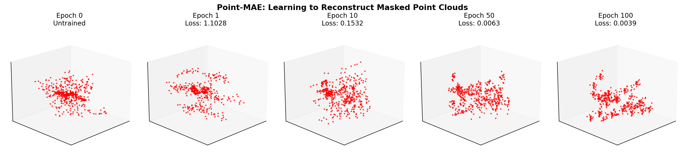
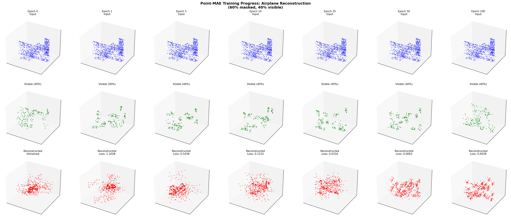
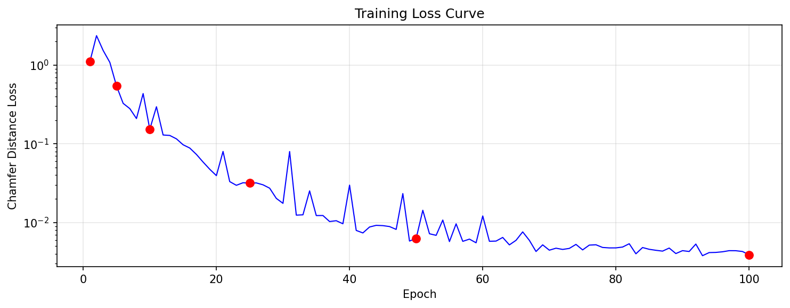

# Point-MAE: Masked Autoencoders for Point Cloud Self-supervised Learning

A clean, minimal PyTorch implementation of Point-MAE for self-supervised point cloud learning.



## Features

- **Pure PyTorch**: CPU and GPU compatible - no CUDA-only dependencies
- **Modular Design**: Clean separation into encoder, attention, transformer modules
- **6-Channel Support**: Handles xyz + normals (ready for diffusion head integration)
- **Random Object Generator**: Built-in 3D shape generator for testing
- **Comprehensive Logging**: Training curves, metrics CSV, visualizations

## Training Progress Demo

The model learns to reconstruct masked point clouds. Here's an airplane being reconstructed at different training epochs:





## Installation

```bash
git clone https://github.com/yourusername/Point-MAE.git
cd Point-MAE
pip install -r requirements.txt
```

### Requirements

```
torch>=1.9.0
numpy
matplotlib>=3.5.0
tqdm>=4.62.0
pytorch3d
```

## Quick Start

### 1. Test with Random Objects (No Dataset Needed)

```bash
python train.py --use_random_objects --epochs 50 --batch_size 8

# Force CPU
python train.py --use_random_objects --epochs 50 --cpu
```

### 2. Generate Training Demo

```bash
python generate_training_demo.py
```

### 3. Train on ModelNet40

```bash
python train.py --data_path ./data --epochs 300 --batch_size 32
```

## Data Preparation

### Preprocessing ModelNet40

1. Download ModelNet40 from [here](https://shapenet.cs.stanford.edu/media/modelnet40_normal_resampled.zip)

2. Run preprocessing:

```python
import numpy as np
import pickle
import os
from tqdm import tqdm

def preprocess_modelnet40(raw_dir, output_dir, num_points=8192):
    """
    Preprocess ModelNet40 to .dat format.
    
    Args:
        raw_dir: Path to modelnet40_normal_resampled/
        output_dir: Output directory for .dat files
        num_points: Number of points per sample
    """
    os.makedirs(output_dir, exist_ok=True)
    
    with open(os.path.join(raw_dir, 'modelnet40_shape_names.txt')) as f:
        categories = [line.strip() for line in f]
    
    for split in ['train', 'test']:
        print(f"Processing {split} split...")
        
        with open(os.path.join(raw_dir, f'modelnet40_{split}.txt')) as f:
            file_list = [line.strip() for line in f]
        
        data = []
        for fname in tqdm(file_list):
            category = '_'.join(fname.split('_')[:-1])
            label = categories.index(category)
            
            fpath = os.path.join(raw_dir, category, fname + '.txt')
            points = np.loadtxt(fpath, delimiter=',').astype(np.float32)
            
            # Sample points
            if len(points) >= num_points:
                idx = np.random.choice(len(points), num_points, replace=False)
            else:
                idx = np.random.choice(len(points), num_points, replace=True)
            points = points[idx]
            
            # Normalize
            centroid = points[:, :3].mean(axis=0)
            points[:, :3] -= centroid
            max_dist = np.max(np.linalg.norm(points[:, :3], axis=1))
            points[:, :3] /= max_dist
            
            data.append((points, label))
        
        output_path = os.path.join(output_dir, f'modelnet40_{split}_{num_points}pts_fps.dat')
        with open(output_path, 'wb') as f:
            pickle.dump(data, f)
        
        print(f"Saved {len(data)} samples to {output_path}")

# Usage:
# preprocess_modelnet40('./modelnet40_normal_resampled', './data')
```

3. Your data directory should look like:

```
data/
├── modelnet40_train_8192pts_fps.dat
└── modelnet40_test_8192pts_fps.dat
```

## Project Structure

```
Point-MAE/
├── models/                     # Model package
│   ├── __init__.py             # Package exports
│   ├── utils.py                # FPS, KNN, initialization
│   ├── encoder.py              # Point cloud encoder + grouping
│   ├── attention.py            # Multi-head attention, MLP, Block
│   ├── transformer.py          # Transformer encoder/decoder
│   ├── point_mae.py            # Main PointMAE model
│   └── objects.py              # Random 3D object generator
├── images/                     # Visualization images
├── train.py                    # Training script with logging
├── dataset.py                  # Dataset loaders
├── config.py                   # Configuration
├── generate_training_demo.py   # Generate demo visualizations
└── requirements.txt            # Dependencies
```

## Model Architecture

```
Input: Point Cloud (B, N, 6) - xyz + normals
    │
    ▼
┌─────────────────────────────┐
│  FPS + KNN Grouping         │  → (B, G, M, 6) groups
│  G=64 groups, M=32 pts each │
└─────────────────────────────┘
    │
    ▼
┌─────────────────────────────┐
│  Point Encoder (Conv1D)     │  → (B, G, 384) tokens
└─────────────────────────────┘
    │
    ▼
┌─────────────────────────────┐
│  Random Masking (60%)       │  → Visible: 40%, Masked: 60%
└─────────────────────────────┘
    │
    ▼
┌─────────────────────────────┐
│  Transformer Encoder        │  → Encode visible tokens
│  (12 layers, 6 heads)       │
└─────────────────────────────┘
    │
    ▼
┌─────────────────────────────┐
│  Transformer Decoder        │  → Reconstruct masked tokens
│  (4 layers, 6 heads)        │
└─────────────────────────────┘
    │
    ▼
┌─────────────────────────────┐
│  Prediction Head            │  → (B, M, 32, 3) xyz points
└─────────────────────────────┘
    │
    ▼
Output: Chamfer Distance Loss
```

## Training Arguments

| Argument | Default | Description |
|----------|---------|-------------|
| `--epochs` | 50 | Number of training epochs |
| `--batch_size` | 8 | Batch size |
| `--lr` | 1e-3 | Learning rate |
| `--num_points` | 1024 | Points per sample |
| `--mask_ratio` | 0.6 | Masking ratio |
| `--num_group` | 32 | Number of point groups |
| `--group_size` | 16 | Points per group |
| `--use_random_objects` | False | Use random shapes instead of dataset |
| `--cpu` | False | Force CPU training |
| `--output_dir` | ./output | Output directory |

## Output Structure

```
output/
├── config.json              # Training configuration
├── checkpoints/
│   ├── best_model.pt        # Best validation model
│   └── checkpoint_*.pt      # Periodic checkpoints
├── logs/
│   ├── train_*.log          # Training log
│   ├── metrics_*.csv        # Metrics CSV
│   └── training_curves.png  # Loss/LR plots
└── visualizations/
    └── epoch_*.png          # Reconstruction visualizations
```

## Random Object Types

Built-in generator creates 6 different 3D shapes for testing:

```python
from model import generate_random_object

# Generate airplane with normals
pts = generate_random_object(num_points=1024, obj_type='airplane', with_normals=True)
# Returns: (1024, 6) numpy array

# Available: 'sphere', 'cube', 'cylinder', 'torus', 'airplane', 'chair', 'random'
```

## Citation

```bibtex
@inproceedings{pang2022masked,
  title={Masked Autoencoders for Point Cloud Self-supervised Learning},
  author={Pang, Yatian and Wang, Wenxiao and Tay, Francis EH and Liu, Wei and Tian, Yonghong and Yuan, Li},
  booktitle={European Conference on Computer Vision},
  pages={604--621},
  year={2022},
  organization={Springer}
}
```

## License

MIT License
